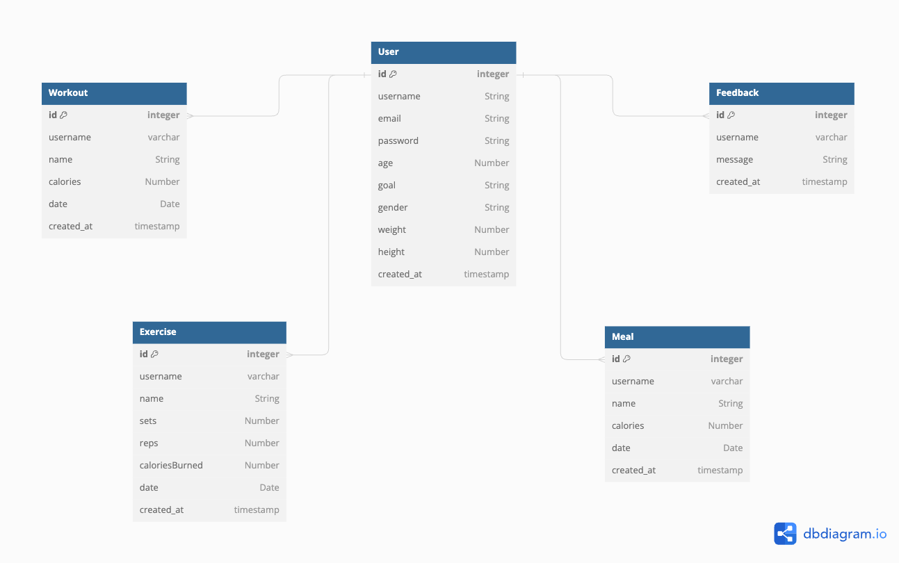

## The Project Title

GYM SPACE APP MERN stack

---

## The Project Description

What problem does your application solve?

My application solves the problem of gymers who are newbies and wondering which exercise workout to do to match their fitness goals.

What does your application do? What features contribute to solving given issues?

In my application,

- For those who are new to gym, it will provide list of exercise of each part of the body.
- For those who are gym-aholic, they can track the exercise they did and share their new achievements.
- It allow users to add up to 10 exercises and log to their profile.
- It allow users to log calories of meals they eat in a day to their profile.
- It provides users with a broad view of calories they consumed and burnt in day/week/month through charts.

Some of the challenges you faced and features you hope to implement in the future?

The tracking progress using chart is the most challenging one since it is new to me.
Second is the source of the statistics to measure.

Some of the features I want to implement:

- Users log their exercises and my app will calculate calories burnt.
- Users log their calories of their meals.
- My app will calculate if that they their calories is surplus or deficit.

---

## User Stories

## Background

GymSpace is a fitness and workout tracking platform that helps individuals take control of their health and fitness journey. Users can create accounts with a unique email, name, and password.

GymSpace allows users to log workouts and exercises, including sets, reps, and weights used. Users can also track meals with nutritional information like calories, protein, carbs, and fats.

The platform enables users to monitor their workout and meal history, adjusting routines or diet as needed. Users can track progress toward fitness goals and see overall improvement.

GymSpace fosters a supportive community where users can connect, view each other's logs, meal plans, and progress. Users can leave support and encouragement on other's log. GymSpace empowers users to reach fitness goals within a community of like-minded individuals.

---

## ERD

---

## Authentication

As a user, I can sign in with my email and password to access my workout tracker data.
As a user, I can register for a new account with my name, email, and password.
As a user, I can stay signed in after refreshing the page or returning to the application.

---

## Users

As a user, I can update my profile with personal information such as name, avatar, and fitness details.
As a user, I can view my own profile, including my workout history, meals, and progress.

---

## Workouts

As a user, I can create a new workout with a name, date, duration.
As a user, I can add exercises to a workout, specifying sets and reps for each exercise.
As a user, I can edit my workouts, such as name, date, or exercises.
As a user, I can delete my workouts if they are no longer relevant.
As a user, I can view my workout history to track my progress over time.

---

## Meals

As a user, I can log my meals, including details such as name and calories.
As a user, I can view my meal history to track my nutrition intake over time.
As a user, I can edit the details of a meal, such as name or nutrition content.
As a user, I can delete meals from my meal history if necessary.

---

## API Endpoint

Auth APIs
/\*\*

- @route POST /auth/login
- @description Log in with username and password
- @body {email, passsword}
- @access Public
  \*/

User APIs
/\*\*

- @route GET /users/page=1?&limit=10
- @description Get users with pagination
- @body
- @access Login required
  \*/

/\*\*

- @route GET /users/me
- @description Get current user info
- @body
- @access Login required
  \*/

/\*\*

- @route GET /users/:id
- @description Get other user profile
- @body
- @access Login required
  \*/

/\*\*

- @route POST /users
- @description Register new user
- @body {name, email, password}
- @access Public
  \*/

/\*\*

- @route PUT /users/:id
- @description Update user profile
- @body {name, avatar, goal, weight, height}
- @access Login required
  \*/

Workout APIs
/\*\*

- @route GET /workouts
- @description Get workouts by query parameters (name, part, equipment, etc.)
- @access Log in required
  \*/

Excercise APIs
/\*\*

- @route POST /posts
- @description Create a new post
- @body {content}
- @access Login reuqired
  \*/

/\*\*

- @route GET /posts/user/userId? page=1&limit=10
- @description Get all posts a user can see with pagination
- @body
- @access Login required
  \*/

/\*\*

- @route PUT /posts/:id
- @description Update a post
- @body {content}
- @access Login required
  \*/

/\*\*

- @route DELETE /posts/:id
- @description Delete a post
- @body
- @access Login required
  \*/

Meal APIs
/\*\*

- @route POST /posts
- @description Create a new post
- @body {content}
- @access Login reuqired
  \*/

/\*\*

- @route GET /posts/user/userId? page=1&limit=10
- @description Get all posts a user can see with pagination
- @body
- @access Login required
  \*/

/\*\*

- @route PUT /posts/:id
- @description Update a post
- @body {content}
- @access Login required
  \*/

/\*\*

- @route DELETE /posts/:id
- @description Delete a post
- @body
- @access Login required
  \*/

Feedback APIs

/\*\*

- @route POST/feedbacks
- @description Create new feedback
- @body rating, feedback
- @login required
  \*/

# finall-be
